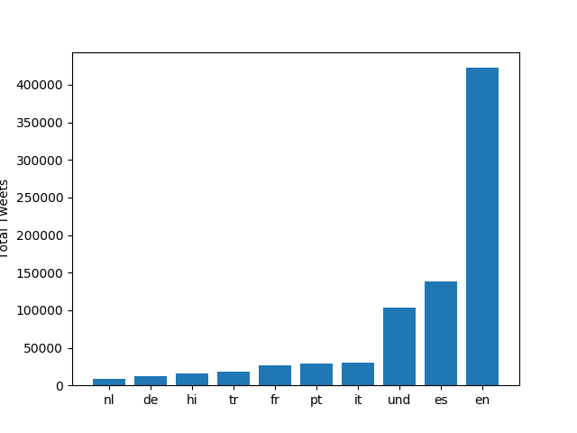

# Coronavirus Twitter Data Analysis

In this project, I analyzed all geotagged tweets sent in 2020 relating to COVID-19. This is done by MapReduce, 
a popular technique for large scale parallel processing. There are 4 functions in play here:

`map.py` processes zip file for every 24 hours worth of tweets, tracking hashtag usage for language and countries

`run_maps.sh` loops over each file and runs `map.py` on each of them

`reduce.py` merges output obtained from `run_maps.sh`

`visualize.py` generates 4 visual bar graphs of the top 10 countries and languages

## Images

Running the following:

```
$ python3 ./src/visualize.py --input_path=reduced.lang --key='#coronavirus'
```

gives us: 



Running the following: 

```
$ python3 ./src/visualize.py --input_path=reduced.country --key='#coronavirus'
```

gives us: 


Running the following:

```
$ python3 ./src/visualize.py --input_path=reduced.lang --key='#코로나바이러스`
```

gives us:


Running the following:

```
$ python3 ./src/visualize.py --input_path=reduced.country --key='#코로나바이러스`
```

gives us:


Finally, I ran alternative_reduce.py to compare the usage of 2 different `--keys`

```
$ python3 ./src/alternative_reduce.py --keys '#hospital' '#doctor'
```

and get:


